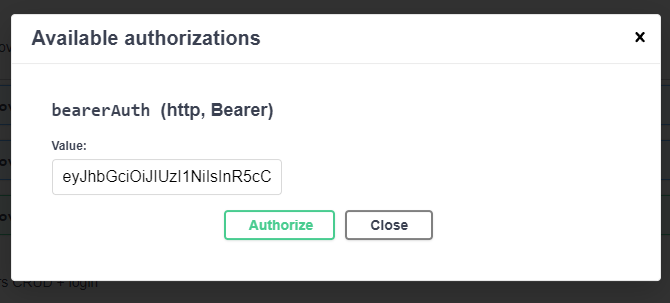

# Programmer test - Node JS back end - [Nur Alif Ilyasa]

Pattern yang digunakan: Middleware.
Karena aplikasi express adalah susunan fungsi middleware.

# How to run

To run my app, simply copy and paste these commands in your terminal:
```
git clone https://github.com/NurAlif/alif_app_express.git
cd alif_app_express

npm install
npm start

```
Now, you can go to http://localhost:3000/api-docs to test the API.
You can use Postman instead of Swagger. The API run on http://localhost:3000


Note: You don't have to setup a database. The database is stored in [database.sqlite](database.sqlite) 

OpenAPI Doc: [apidoc.json](config/api-doc.json)


# Testing with swagger
1. Run the app on terminal

   
2. Go to http://localhost:3000/api-docs

   
3. You need a user. You can either create a new one or login with registered user. If you want to create a new user select Create user endpoint. 
   
   
   
    Or, you can use this account to login:
    ```
    {
        id: 1,
        password: alif1234
    } 
    ```
4. Press try out to test the endpoint

   
   You can edit the request body if you want
   
   
5. Press execute to send a GET request. Then, the response will appear:
   
   
   The response of create user endpoint is a token. Copy the token, and paste it in Authorize. This will make every endpoint that needs bearer token will be filled with this token. Otherwise the server will return code 403.
   
   
   
   
   
   
   
   If you want to log out, you can press log out inside Authorize modal.
   Without a bearer token, the response would look like this:
   
   

6. Now we can send a request with any endpoint.
   This is a request to get a poster url of Rambo:
   
   
   
   
 
   Try with any movie title you remember!

7. Add your favorite movies
   
   
   
   Add as many as you want!
8. Read all your favorite movies

   
  
   


# Contact
If you run into a problem feel free to contact me

nuralif.2020@student.uny.ac.id

https://wa.me/qr/5NGTX5JDQNFKF1


